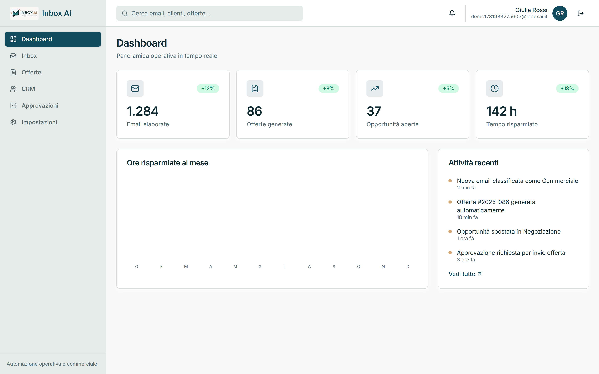
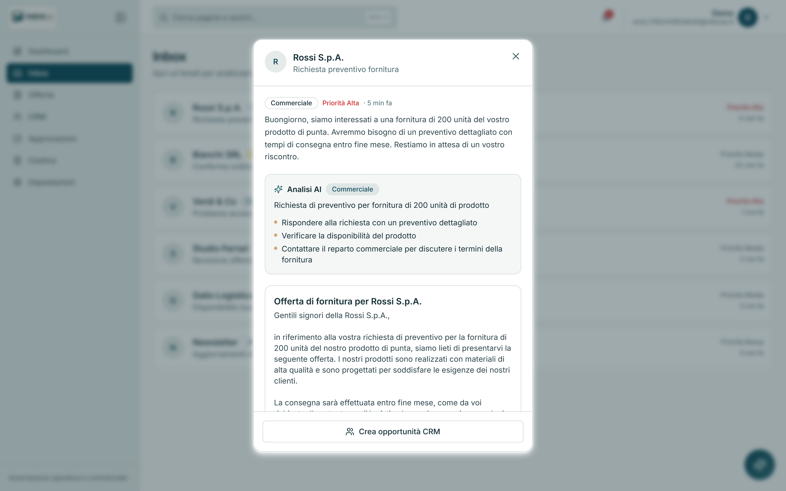
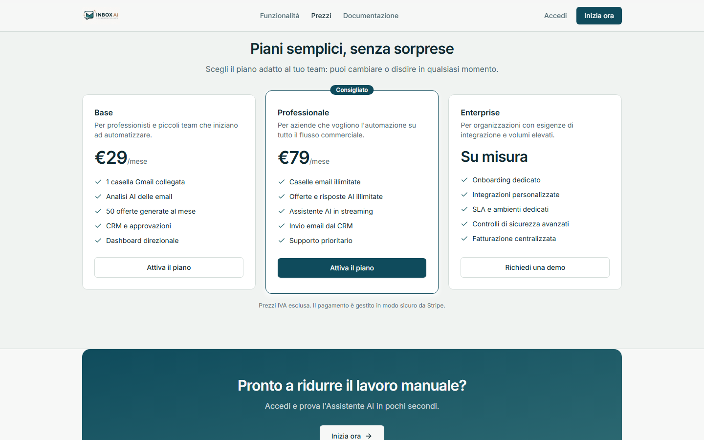

<div align="center">
  

  **Piattaforma SaaS B2B per automatizzare attività operative, commerciali e amministrative tramite intelligenza artificiale.**

  
  
  
</div>

> Inbox AI non è un chatbot. È un sistema che comprende le comunicazioni aziendali,
> automatizza i processi ripetitivi e mantiene il **controllo umano** nei passaggi critici.

---

## Indice

- [Panoramica](#panoramica)
- [Demo](#demo)
- [Moduli](#moduli)
- [Piani e pagamenti (Stripe)](#piani-e-pagamenti-stripe)
- [Stack tecnologico](#stack-tecnologico)
- [Architettura](#architettura) · [Diagrammi UML](docs/ARCHITECTURE.md)
- [Astrazione AI](#astrazione-ai)
- [Avvio rapido](#avvio-rapido)
- [Variabili dambiente](#variabili-dambiente)
- [Script disponibili](#script-disponibili)
- [Sicurezza](#sicurezza)
- [Deploy](#deploy)
- [Licenza](#licenza)

---

## Panoramica

Inbox AI riceve, comprende e organizza le comunicazioni aziendali (email, richieste,
documenti) e automatizza i flussi operativi che ne derivano: classificazione dei messaggi,
generazione di offerte, aggiornamento della pipeline commerciale (CRM) e workflow di
approvazione con supervisione umana. Tutto è esposto in un'unica area di lavoro
professionale, con KPI in tempo reale.

L'interfaccia è interamente in **italiano** e segue la palette **Deep Petroleum** per una
resa sobria e professionale.

Oltre all'area di lavoro autenticata è presente un **sito pubblico** di presentazione
(landing con **piani di abbonamento**, funzionalità e **documentazione con tutorial**).
Dentro l'app, una **ricerca rapida** (Ctrl/⌘K), un **centro notifiche** e notifiche
*toast* velocizzano l'uso quotidiano.

## Demo


> Dalla landing all'accesso, alla **dashboard direzionale** con filtro per anno e
> grafici in tempo reale, all'**automazione AI** (analisi email → offerta generata →
> creazione), al **CRM**, alle **offerte** e all'**assistente AI in streaming**.

### Dashboard direzionale

KPI con variazione mensile, **filtro per anno**, andamento mensile, pipeline per fase
(donut), quote per stato e **risultato commerciale a cascata** — tutto calcolato sui
dati reali dell'utente.



### Automazione AI — analizza l'email, genera l'offerta, crea l'opportunità

Apri un'email reale (Gmail) e lascia che l'AI la classifichi, generi un'offerta o
crei un'opportunità nel CRM.



## Moduli

| Modulo           | Descrizione |
|------------------|-------------|
| **Dashboard**    | Report direzionale sui dati reali con filtro per anno: 5 KPI con variazione mensile, andamento mensile, pipeline per fase, offerte per stato e risultato commerciale a cascata. |
| **Assistente**   | Widget di chat AI flottante (in streaming), disponibile su ogni pagina, per gestire email, offerte, opportunità e approvazioni. |
| **Inbox**        | Email ricevute, classificate per categoria/priorità; apri un'email per **analizzarla con l'AI**, **generare un'offerta** o **creare un'opportunità** nel CRM. |
| **Offerte**      | Generazione assistita dall'**AI** ("Genera con AI"), **modifica in linea** e versioning dei documenti commerciali (Bozza → In revisione → Approvata → Inviata). |
| **CRM**          | Pipeline a colonne (Nuovo → In Analisi → Offerta Inviata → Negoziazione → Chiuso); clienti con foto e campi **modificabili in linea**. |
| **Approvazioni** | Workflow approvativi con controllo umano: Bozza → Revisione → Approvazione → Esecuzione. |
| **Cestino**      | Gli elementi eliminati finiscono nel cestino (soft delete): **ripristinabili** o eliminabili definitivamente. |
| **Impostazioni** | Foto profilo, dati dell'organizzazione e configurazione delle automazioni email. |

## Piani e pagamenti (Stripe)

La landing espone tre piani di abbonamento (**Base**, **Professionale**,
**Enterprise**) con checkout gestito da **Stripe Checkout** (pagina di pagamento
ospitata — nessun dato di carta transita dal backend).



- **Modalità demo (default):** senza chiavi Stripe configurate l'endpoint
  `POST /api/billing/checkout` risponde `{ "demo": true }` e la landing invita
  alla registrazione senza avviare pagamenti.
- **Attivazione reale:** impostare `STRIPE_SECRET_KEY` e i price ID
  (`STRIPE_PRICE_BASE`, `STRIPE_PRICE_PRO`) creati nella dashboard Stripe
  (Prodotti → prezzo ricorrente). Da quel momento il pulsante "Attiva il piano"
  reindirizza alla pagina di pagamento Stripe (integrazione via API REST,
  nessuna dipendenza aggiuntiva).
- `STRIPE_WEBHOOK_SECRET` è già previsto in configurazione per la futura
  gestione degli eventi di abbonamento (rinnovi, cancellazioni).

## Stack tecnologico

| Livello   | Tecnologie                                                  |
|-----------|-------------------------------------------------------------|
| Frontend  | React, React Router, TanStack Query, TailwindCSS, Shadcn UI |
| Backend   | Node.js, Express.js                                         |
| Database  | MongoDB Atlas (con fallback in memoria per la modalità demo)|
| Auth      | Sessione con cookie firmato (JWT) + protezione CSRF, accesso con Google opzionale |
| Deploy    | Vercel (frontend), Render (backend)                         |

## Architettura

> 📐 **Diagrammi UML completi** — componenti e deploy, classi del dominio, ER,
> sequenze (automazione AI, autenticazione) e cicli di vita — in
> [`docs/ARCHITECTURE.md`](docs/ARCHITECTURE.md).

```
.
├── frontend/              # Frontend React + Vite
│   ├── src/
│   │   ├── components/     # UI, layout, grafici dashboard (SVG), guardie di rotta
│   │   ├── hooks/          # Hook TanStack Query (offerte, opportunità, approvazioni, auth)
│   │   ├── lib/            # Client API (fetch + cookie + CSRF)
│   │   ├── pages/          # Dashboard, Inbox, Offerte, CRM, Approvazioni, Cestino, Impostazioni, Login
│   │   └── pages/marketing/ # Sito pubblico: Landing, Funzionalità, Documentazione
│   └── public/            # logo.jpeg, icon.jpeg
├── backend/               # Backend Node + Express
│   └── src/
│       ├── config/        # env (validazione zod), connessione DB
│       ├── controllers/   # auth, crud, ai, gmail, dashboard, inbox, notifiche, billing
│       ├── middleware/    # auth, rate limiting, gestione errori
│       ├── models/        # User, Offerta, Opportunità, Approvazione, RevokedToken, Contatore
│       ├── routes/        # router REST sotto /api
│       ├── services/      # logica di dominio + CRUD generico
│       │   └── ai/        # layer di astrazione AI (vedi sotto)
│       └── utils/         # firma token, CSRF, cifratura, async handler
├── scripts/               # Verifica e2e del prod, pulizia utenti di test
├── .github/workflows/     # CI (build+lint+test → deploy Render) e keep-alive
└── render.yaml            # Configurazione deploy backend (Render)
```

## Astrazione AI

Tutte le funzionalità AI passano attraverso un **layer di astrazione**
(`backend/src/services/ai/providers/AIProvider.ts`). Il frontend non conosce **mai** il
provider, il modello o il brand utilizzato: nessun nome di modello o fornitore è esposto
al client. Sostituire o aggiungere un provider significa implementare l'interfaccia
`AIProvider` senza toccare il resto dell'applicazione.

L'**Assistente** è una chat conversazionale con risposta in **streaming (SSE)**.
L'implementazione di riferimento è euristica e locale; il provider `groq` usa un LLM reale
con **validazione dell'output** (`zod`) e **fallback automatico** all'euristica in caso di
errore, così gli endpoint restano sempre disponibili.

## Avvio rapido

```bash
# 1. Installa tutte le dipendenze (npm workspaces)
npm install

# 2. Crea un file .env nella radice con le variabili elencate
#    nella sezione "Variabili d'ambiente" (in demo bastano i default)

# 3. Avvia frontend + backend insieme
npm run dev
```

- Frontend: http://localhost:5173
- Backend:  http://localhost:4000

> **Modalità demo:** senza `MONGODB_URI` il backend si avvia in modalità demo con dati di
> esempio in memoria. È possibile registrarsi con email/password e navigare l'intera
> applicazione senza alcun servizio esterno.

## Variabili d'ambiente

Un unico file `.env` nella radice del progetto serve sia il frontend (Vite) sia il backend.

| Variabile               | Ambito   | Descrizione |
|-------------------------|----------|-------------|
| `NODE_ENV`              | Entrambi | `development` \| `production` \| `test`. |
| `PORT`                  | Backend  | Porta API (default `4000`). |
| `CLIENT_URL`            | Backend  | Origini consentite dal CORS (separate da virgola). |
| `MONGODB_URI`           | Backend  | Connessione MongoDB Atlas. Obbligatoria in produzione. |
| `JWT_SECRET`            | Backend  | Segreto per la firma dei cookie di sessione. Obbligatorio in produzione. |
| `VERCEL_PROJECT`        | Backend  | Slug Vercel: abilita le anteprime `<slug>*.vercel.app` nel CORS. |
| `GOOGLE_CLIENT_ID`      | Backend  | Verifica del token Google (accesso opzionale). |
| `GOOGLE_CLIENT_SECRET`  | Backend  | Credenziale Google (collegamento Gmail). |
| `GMAIL_APP_USER`        | Backend  | Account Gmail per le email di sistema (reset password). |
| `GMAIL_APP_PASSWORD`    | Backend  | App password Gmail per l'SMTP. |
| `STRIPE_SECRET_KEY`     | Backend  | Chiave segreta Stripe. Assente = checkout in modalità demo. |
| `STRIPE_PRICE_BASE`     | Backend  | Price ID Stripe del piano Base (`price_...`). |
| `STRIPE_PRICE_PRO`      | Backend  | Price ID Stripe del piano Professionale (`price_...`). |
| `STRIPE_WEBHOOK_SECRET` | Backend  | Firma dei webhook Stripe (gestione eventi futura). |
| `AI_PROVIDER`           | Backend  | Provider AI astratto: `default` (euristico) o `groq`. |
| `AI_API_KEY`            | Backend  | Chiave del provider AI (mai esposta al client). |
| `AI_MODEL`              | Backend  | Modello del provider AI (opzionale; per Groq default `llama-3.3-70b-versatile`). |
| `VITE_PORT`             | Frontend | Porta del dev server (default `5173`). |
| `VITE_API_URL`          | Frontend | URL dell'API in produzione. |
| `VITE_API_PROXY`        | Frontend | Proxy dell'API in sviluppo. |
| `VITE_GOOGLE_CLIENT_ID` | Frontend | Client ID Google per il pulsante di accesso. |

## Script disponibili

| Comando             | Effetto |
|---------------------|---------|
| `npm run dev`       | Avvia client e server in parallelo. |
| `npm run build`     | Build di produzione di client e server. |
| `npm run lint`      | Lint su tutti i workspace. |
| `npm test`          | Test automatici del backend (`node:test`). |
| `node scripts/verify-prod-e2e.mjs` | Verifica end-to-end dell'ambiente di produzione. |
| `node scripts/cleanup-test-users.mjs [--apply]` | Rimuove gli utenti di test creati dalle verifiche. |
| `node scripts/record-demo.mjs` | Registra il video walkthrough del README (webm → GIF). |

## Sicurezza

- **Sessioni** con cookie firmato (`HttpOnly`), protezione **CSRF** double-submit per le
  richieste che modificano lo stato, e **revoca lato server** del token al logout (denylist per `jti`).
- **CORS** con allowlist esplicita (`CLIENT_URL`); le anteprime `*.vercel.app` sono ammesse
  solo se `VERCEL_PROJECT` è configurato (nessun wildcard per impostazione predefinita).
- **Helmet** per gli header di sicurezza HTTP.
- **Rate limiting** sulle rotte sensibili (autenticazione e AI).
- **Validazione input** con `zod` su tutti i payload.
- **Secret obbligatori in produzione** (`MONGODB_URI`, `JWT_SECRET`): l'avvio si interrompe
  se mancanti; `JWT_SECRET` deve essere lungo almeno 32 caratteri.
- Il provider AI e le sue chiavi restano **lato server**, non raggiungibili dal client.

## Deploy

- **Frontend → Vercel:** build statico da `frontend/` (`vercel.json` incluso).
- **Backend → Render:** configurazione in `render.yaml`. Impostare `MONGODB_URI`,
  `JWT_SECRET` e le variabili Google/AI come *secret* nel pannello Render.

## Licenza

Software **proprietario — tutti i diritti riservati**. Vedi [LICENSE](LICENSE).
Proprietario: **Kallebe Gallo**.
