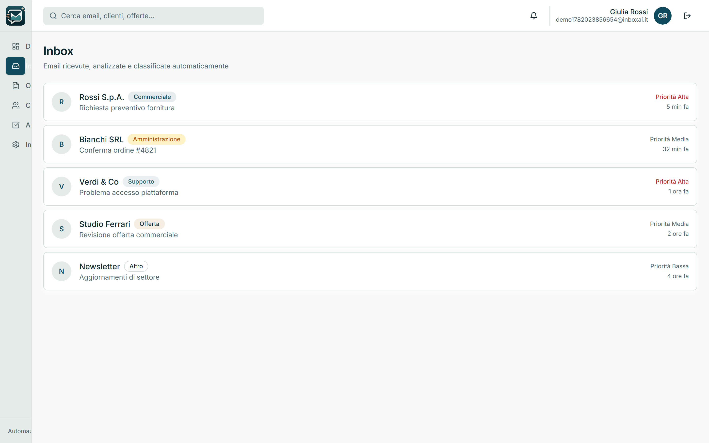
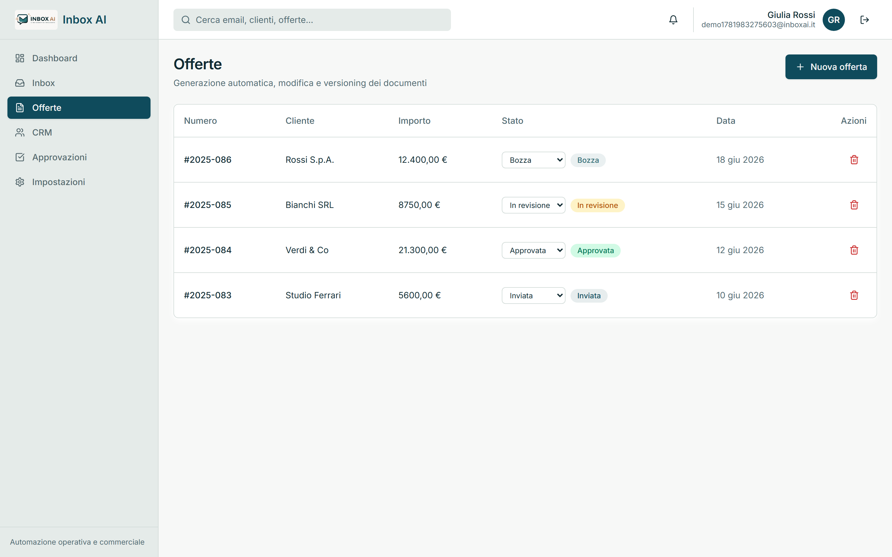
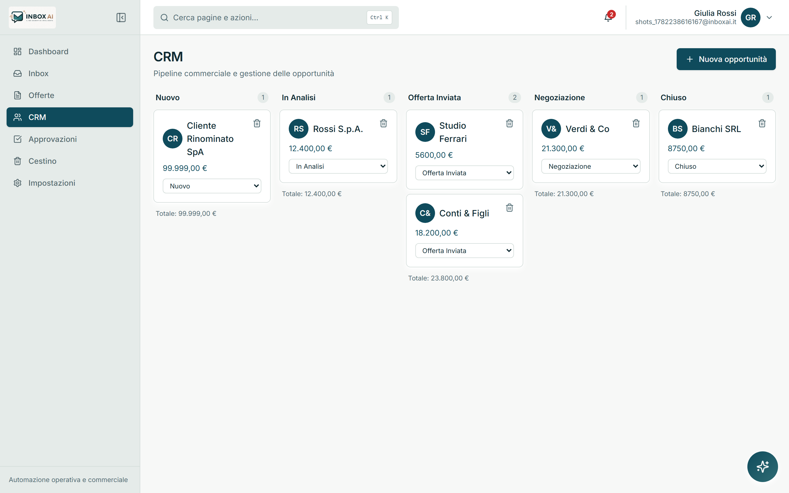
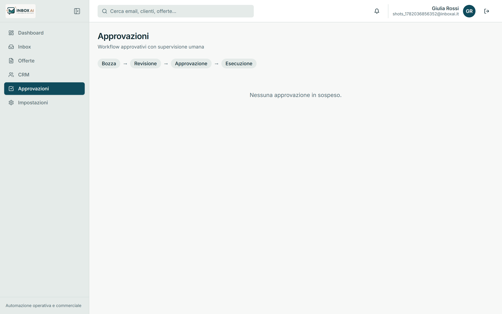
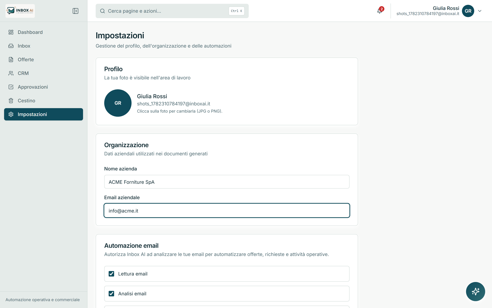
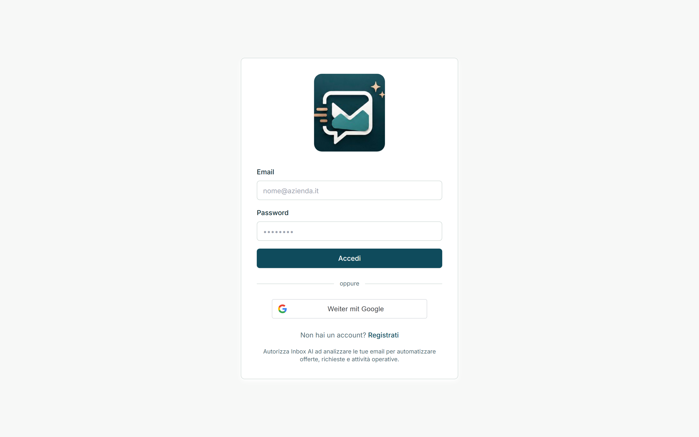

<div align="center">
  

  **Piattaforma SaaS B2B per automatizzare attività operative, commerciali e amministrative tramite intelligenza artificiale.**

  
  
  
</div>

> Inbox AI non è un chatbot. È un sistema che comprende le comunicazioni aziendali,
> automatizza i processi ripetitivi e mantiene il **controllo umano** nei passaggi critici.

---

## Indice

- [Panoramica](#panoramica)
- [Anteprima](#anteprima)
- [Moduli](#moduli)
- [Stack tecnologico](#stack-tecnologico)
- [Architettura](#architettura)
- [Astrazione AI](#astrazione-ai)
- [Avvio rapido](#avvio-rapido)
- [Variabili dambiente](#variabili-dambiente)
- [Script disponibili](#script-disponibili)
- [Sicurezza](#sicurezza)
- [Deploy](#deploy)
- [Licenza](#licenza)

---

## Panoramica

Inbox AI riceve, comprende e organizza le comunicazioni aziendali (email, richieste,
documenti) e automatizza i flussi operativi che ne derivano: classificazione dei messaggi,
generazione di offerte, aggiornamento della pipeline commerciale (CRM) e workflow di
approvazione con supervisione umana. Tutto è esposto in un'unica area di lavoro
professionale, con KPI in tempo reale.

L'interfaccia è interamente in **italiano** e segue la palette **Deep Petroleum** per una
resa sobria e professionale.

## Anteprima

### Dashboard — panoramica operativa in tempo reale


### Inbox — email analizzate e classificate automaticamente


### Offerte — generazione, modifica e versioning dei documenti


### CRM — pipeline commerciale e gestione delle opportunità


### Approvazioni — workflow con supervisione umana


### Impostazioni — organizzazione e automazioni


### Accesso


## Moduli

| Modulo           | Descrizione |
|------------------|-------------|
| **Dashboard**    | KPI operativi (email elaborate, offerte generate, opportunità aperte, tempo risparmiato) e attività recenti. |
| **Inbox**        | Email ricevute, analizzate e classificate per categoria e priorità. |
| **Offerte**      | Generazione automatica, modifica e versioning dei documenti commerciali (Bozza → In revisione → Approvata → Inviata). |
| **CRM**          | Pipeline a colonne: Nuovo → In Analisi → Offerta Inviata → Negoziazione → Chiuso. |
| **Approvazioni** | Workflow approvativi con controllo umano: Bozza → Revisione → Approvazione → Esecuzione. |
| **Impostazioni** | Dati dell'organizzazione e configurazione delle automazioni email. |

## Stack tecnologico

| Livello   | Tecnologie                                                  |
|-----------|-------------------------------------------------------------|
| Frontend  | React, React Router, TanStack Query, TailwindCSS, Shadcn UI |
| Backend   | Node.js, Express.js                                         |
| Database  | MongoDB Atlas (con fallback in memoria per la modalità demo)|
| Auth      | Sessione con cookie firmato (JWT) + protezione CSRF, accesso con Google opzionale |
| Deploy    | Vercel (frontend), Render (backend)                         |

## Architettura

```
.
├── frontend/              # Frontend React + Vite
│   ├── src/
│   │   ├── components/     # UI, layout, guardie di rotta
│   │   ├── hooks/          # Hook TanStack Query (offerte, opportunità, approvazioni, auth)
│   │   ├── lib/            # Client API (fetch + cookie + CSRF)
│   │   └── pages/          # Dashboard, Inbox, Offerte, CRM, Approvazioni, Impostazioni, Login
│   └── public/            # logo.jpeg, icon.jpeg
├── backend/               # Backend Node + Express
│   └── src/
│       ├── config/        # env (validazione zod), connessione DB
│       ├── controllers/   # auth, crud, ai
│       ├── middleware/    # auth, rate limiting, gestione errori
│       ├── models/        # User, Offerta, Opportunità, Approvazione
│       ├── routes/        # router REST sotto /api
│       ├── services/      # logica di dominio + CRUD generico
│       │   └── ai/        # layer di astrazione AI (vedi sotto)
│       └── utils/         # firma token, CSRF
└── render.yaml            # Configurazione deploy backend (Render)
```

## Astrazione AI

Tutte le funzionalità AI passano attraverso un **layer di astrazione**
(`backend/src/services/ai/providers/AIProvider.ts`). Il frontend non conosce **mai** il
provider, il modello o il brand utilizzato: nessun nome di modello o fornitore è esposto
al client. Sostituire o aggiungere un provider significa implementare l'interfaccia
`AIProvider` senza toccare il resto dell'applicazione.

## Avvio rapido

```bash
# 1. Installa tutte le dipendenze (npm workspaces)
npm install

# 2. Crea un file .env nella radice con le variabili elencate
#    nella sezione "Variabili d'ambiente" (in demo bastano i default)

# 3. Avvia frontend + backend insieme
npm run dev
```

- Frontend: http://localhost:5173
- Backend:  http://localhost:4000

> **Modalità demo:** senza `MONGODB_URI` il backend si avvia in modalità demo con dati di
> esempio in memoria. È possibile registrarsi con email/password e navigare l'intera
> applicazione senza alcun servizio esterno.

## Variabili d'ambiente

Un unico file `.env` nella radice del progetto serve sia il frontend (Vite) sia il backend.

| Variabile               | Ambito   | Descrizione |
|-------------------------|----------|-------------|
| `NODE_ENV`              | Entrambi | `development` \| `production` \| `test`. |
| `PORT`                  | Backend  | Porta API (default `4000`). |
| `CLIENT_URL`            | Backend  | Origini consentite dal CORS (separate da virgola). |
| `MONGODB_URI`           | Backend  | Connessione MongoDB Atlas. Obbligatoria in produzione. |
| `JWT_SECRET`            | Backend  | Segreto per la firma dei cookie di sessione. Obbligatorio in produzione. |
| `GOOGLE_CLIENT_ID`      | Backend  | Verifica del token Google (accesso opzionale). |
| `GOOGLE_CLIENT_SECRET`  | Backend  | Credenziale Google. |
| `AI_PROVIDER`           | Backend  | Provider AI astratto (default `default`). |
| `AI_API_KEY`            | Backend  | Chiave del provider AI (mai esposta al client). |
| `VITE_API_URL`          | Frontend | URL dell'API in produzione. |
| `VITE_API_PROXY`        | Frontend | Proxy dell'API in sviluppo. |
| `VITE_GOOGLE_CLIENT_ID` | Frontend | Client ID Google per il pulsante di accesso. |

## Script disponibili

| Comando             | Effetto |
|---------------------|---------|
| `npm run dev`       | Avvia client e server in parallelo. |
| `npm run build`     | Build di produzione di client e server. |
| `npm run lint`      | Lint su tutti i workspace. |
| `npm run install:all` | Installa le dipendenze di tutti i workspace. |

## Sicurezza

- **Sessioni** con cookie firmato (`HttpOnly`), protezione **CSRF** double-submit per le
  richieste che modificano lo stato.
- **CORS** con allowlist esplicita (`CLIENT_URL`) più i deploy di anteprima `*.vercel.app`.
- **Helmet** per gli header di sicurezza HTTP.
- **Rate limiting** sulle rotte sensibili.
- **Validazione input** con `zod` su tutti i payload.
- **Secret obbligatori in produzione** (`MONGODB_URI`, `JWT_SECRET`): l'avvio si interrompe
  se mancanti.
- Il provider AI e le sue chiavi restano **lato server**, non raggiungibili dal client.

## Deploy

- **Frontend → Vercel:** build statico da `frontend/` (`vercel.json` incluso).
- **Backend → Render:** configurazione in `render.yaml`. Impostare `MONGODB_URI`,
  `JWT_SECRET` e le variabili Google/AI come *secret* nel pannello Render.

## Licenza

Software **proprietario — tutti i diritti riservati**. Vedi [LICENSE](LICENSE).
Proprietario: **Kallebe Gallo**.
