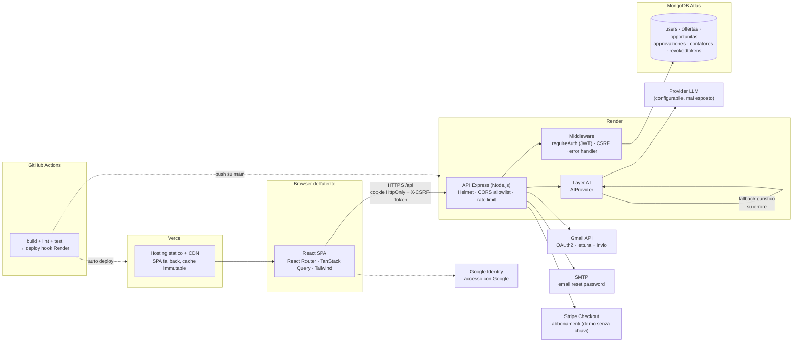
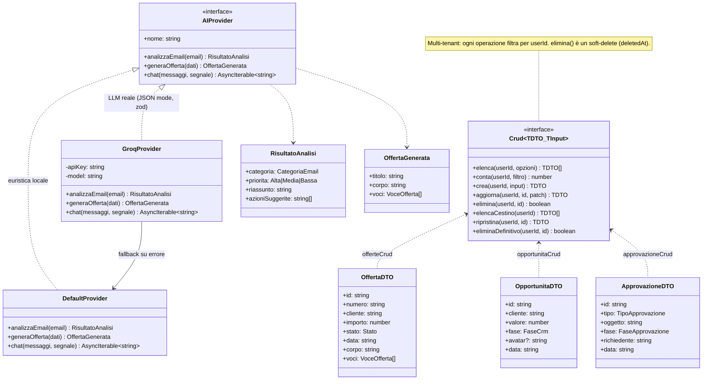
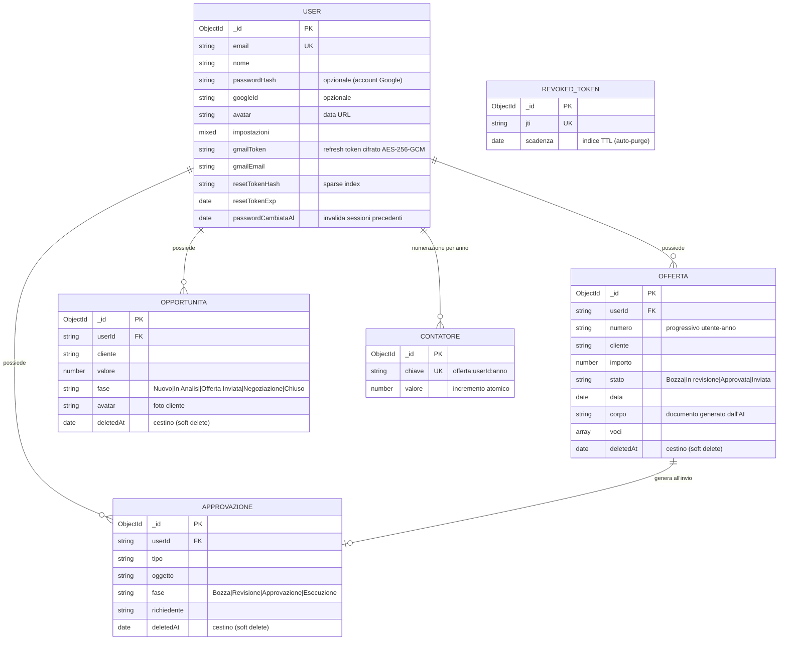
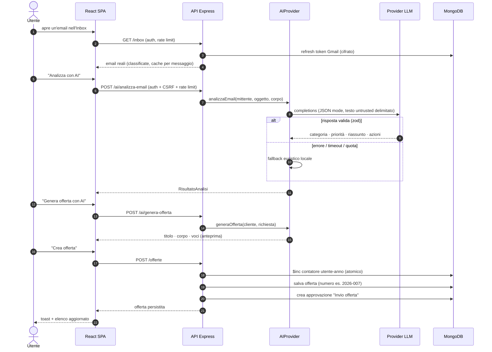
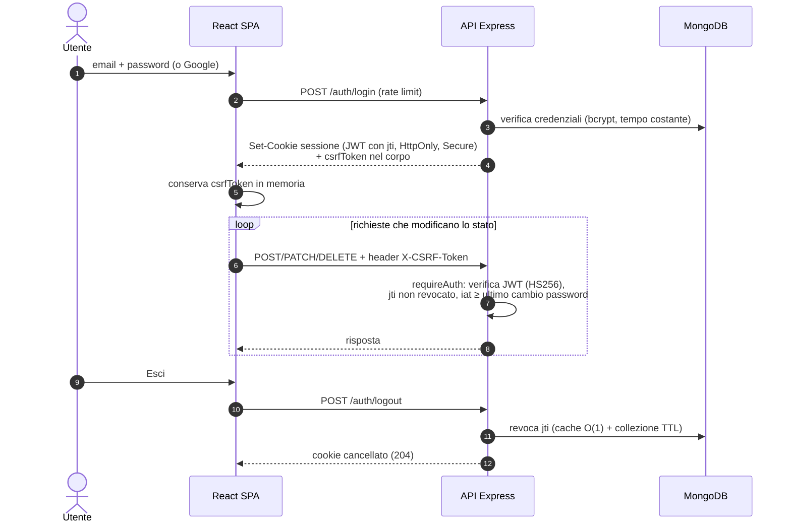
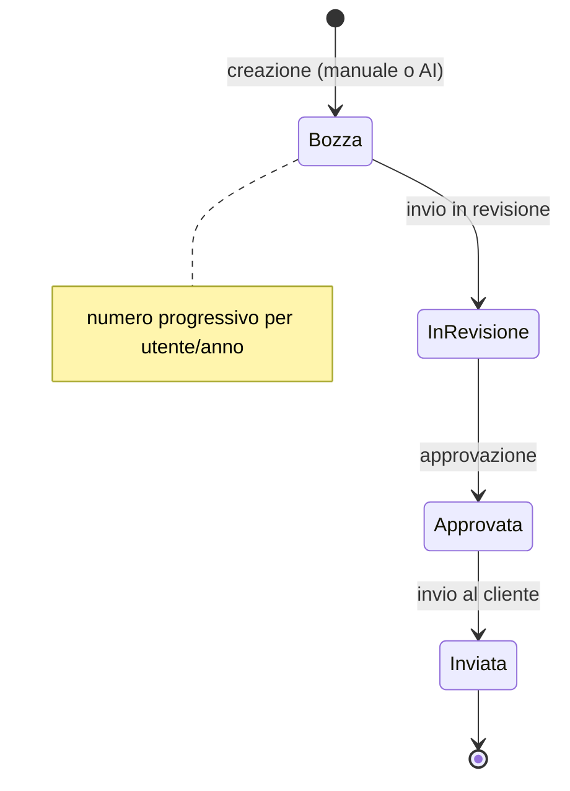
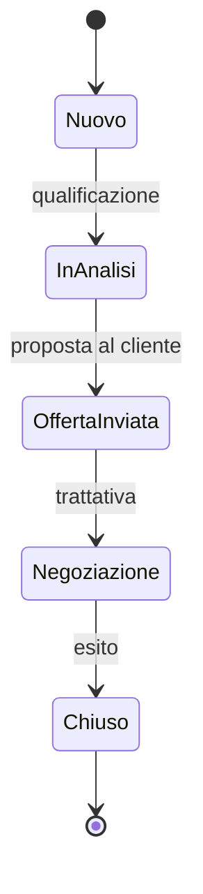
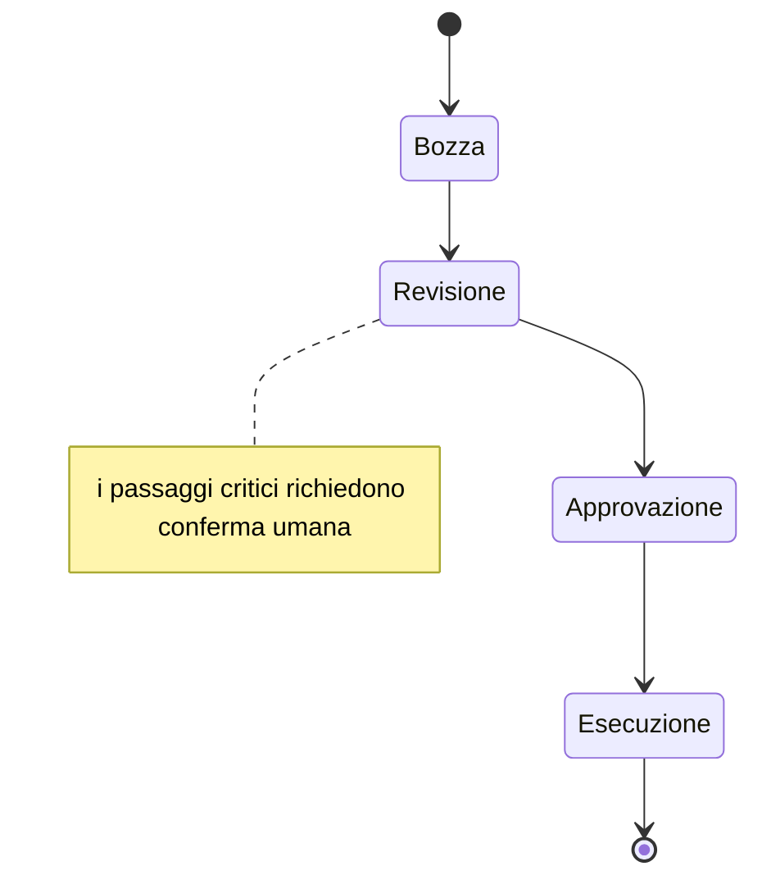
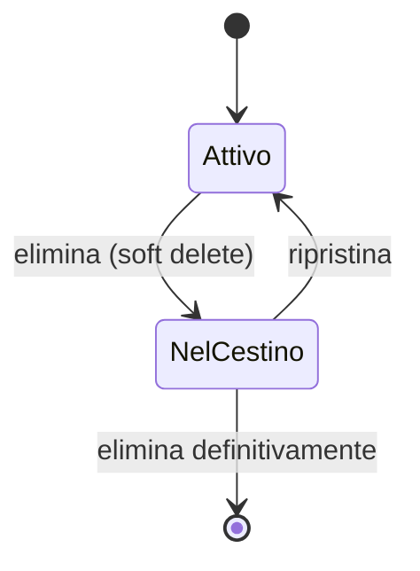

# Architettura e diagrammi UML — Inbox AI

Documentazione tecnica dell'architettura di Inbox AI: componenti, dominio,
flussi principali e ciclo di vita delle entità. I diagrammi sono in formato
[Mermaid](https://mermaid.js.org/) e vengono renderizzati direttamente da GitHub.

## Indice

- [Diagramma dei componenti e del deploy](#diagramma-dei-componenti-e-del-deploy)
- [Diagramma delle classi — dominio backend](#diagramma-delle-classi--dominio-backend)
- [Diagramma ER — persistenza](#diagramma-er--persistenza)
- [Sequenza — automazione AI (email → offerta)](#sequenza--automazione-ai-email--offerta)
- [Sequenza — autenticazione e sessione](#sequenza--autenticazione-e-sessione)
- [Diagrammi di stato — cicli di vita](#diagrammi-di-stato--cicli-di-vita)

---

## Diagramma dei componenti e del deploy

Vista d'insieme: frontend statico su Vercel, API su Render, MongoDB Atlas e
servizi esterni. Il provider AI è **isolato dietro un layer di astrazione** e
non è mai esposto al client.

---

## Diagramma delle classi — dominio backend

Il cuore del backend: un **CRUD generico multi-tenant** (ogni risorsa è
filtrata per `userId`, con cestino/soft-delete) riusato da tre risorse, e il
**contratto `AIProvider`** con due implementazioni intercambiabili.

---

## Diagramma ER — persistenza

Collezioni MongoDB e relazioni logiche. L'isolamento multi-tenant passa dal
campo `userId` presente su ogni risorsa; gli indici composti coprono le query
calde (`userId + deletedAt + createdAt`).

---

## Sequenza — automazione AI (email → offerta)

Il flusso di valore centrale del prodotto: dall'email reale (Gmail) alla
classificazione, alla generazione dell'offerta, fino alla persistenza con
numero progressivo e approvazione automatica.

---

## Sequenza — autenticazione e sessione

Sessione con cookie firmato `HttpOnly` + protezione CSRF double-submit
(il token viaggia nel corpo della risposta perché frontend e backend stanno
su domini diversi). Al logout il token è revocato lato server tramite `jti`.

---

## Diagrammi di stato — cicli di vita

### Offerta

### Opportunità (pipeline CRM)

### Approvazione (controllo umano)

### Elementi eliminati (cestino)

